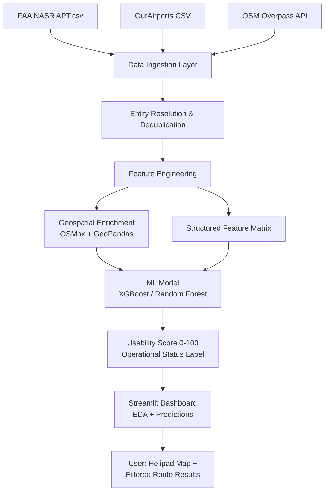

# ziv
זיו — פרויקט קורס LBS (016833)
SkyRoute - Door-to-Sky-to-Door Navigation Solution

# ✈️ SkyRoute — Advanced Air Mobility Navigation Platform

> *"Door-to-sky-to-door. Your fastest path, elevated."*

---

## One-Liner

**Business travelers in dense U.S. metros** suffer from fragmented urban mobility and hours lost to traffic, with no platform combining Advanced Air Mobility (AAM) into seamless door-to-door journeys — so we're building **SkyRoute**, an operator-agnostic multimodal routing and booking platform that uses **ML-powered helipad intelligence and route optimization** to deliver verified air+ground itineraries across the New York metro and beyond.

---

## The Problem

Business travelers and frequent flyers lose hours daily to urban traffic congestion, long airport transfers, and the friction between transport modes. In a world where minutes equal billable hours, no single platform today enables seamless planning and booking of eVTOL aircraft, helicopters, and ground transport as a unified, door-to-door journey.

Existing solutions are siloed: Blade books helicopters but lacks multimodal integration; Google Maps offers ground routing but ignores AAM entirely; Joby and Volocopter serve their own operators only. There is no operator-agnostic, business-grade platform that fuses all modes.

Beyond routing, the underlying infrastructure data is broken. Public helipad databases (FAA, OurAirports, OSM) are notoriously inconsistent — outdated coordinates, decommissioned pads listed as active, missing usability metadata. Feeding this raw data into a routing engine creates liability and trust failures.

**SkyRoute solves both problems:** the routing layer and the data quality layer beneath it.

---

## Target User

**Persona:** Miles Urban, 44, VP of Business Development at a Manhattan-based financial services firm. Travels 4–5 times per week across the New York metro area — Midtown Manhattan, JFK/EWR, Jersey City, Greenwich CT — for client meetings and board sessions. Every wasted hour is a billable hour lost; he holds a corporate Amex with no travel cap.

**Primary Use Case:** Miles has a 9:30 AM board meeting in Greenwich, CT and is leaving his Midtown office at 8:45 AM. Ground traffic makes it 75+ minutes by car. He opens SkyRoute, enters origin and destination, and receives: 6-minute walk to the verified 30th Street Heliport → 18-minute helicopter to Westchester County Airport → 12-minute car to the client's office. One booking, one payment, live tracking. Total: 36 minutes. He lands with time to spare.

---

## Data Sources & Data Card

### Primary Dataset: FAA NASR/AIDP Helipad Database
- **URL:** https://www.faa.gov/air_traffic/flight_info/aeronav/aero_data/NASR_Subscription/
- **Size:** ~14,000 helipad records (APT.csv subset), updated every 28 days
- **Format:** CSV with fixed-width fields; key columns: `site_number`, `facility_name`, `latitude_deg`, `longitude_deg`, `state_code`, `ownership_type`, `use`, `elevation_ft`, `lighting`
- **License:** Public Domain (U.S. Government data)
- **Known Gaps:** ~30% of records missing usability metadata (surface type, dimensions); coordinate accuracy varies; no operational status field — must be inferred from NOTAMs or imagery
- **Potential Biases:** Heavy U.S. coverage; international helipads severely underrepresented; hospital/emergency pads overrepresented vs. commercial pads

### Secondary Dataset: OurAirports Helipad CSV
- **URL:** https://ourairports.com/data/ (airports.csv filtered by `type=heliport`)
- **Size:** ~70,000 global entries
- **Format:** CSV; key columns: `id`, `ident`, `name`, `latitude_deg`, `longitude_deg`, `iso_country`, `iso_region`, `municipality`, `wikipedia_link`
- **License:** Public Domain (CC0)
- **Known Gaps:** User-submitted; accuracy unverified; many duplicates across national borders; ~40% lack elevation data

### Tertiary: OpenStreetMap (aeroway=helipad)
- **URL:** https://overpass-turbo.eu/ (`aeroway=helipad`)
- **Format:** GeoJSON via Overpass API
- **License:** ODbL

---

## Formal ML Problem Statement

### Task: Helipad Usability Score Prediction

**X (Input features):**
- Structured registry fields: ownership type, elevation, lighting code, surface type (where available), state/country
- Geospatial features: proximity to hospitals, airports, urban centers (from OSM); population density
- Source agreement score: number of databases that list this helipad (proxy for ground truth confidence)
- Days since last data update (data freshness)

**y (Target):**
- Binary classification: `operational` (1) vs. `non-operational / unreliable` (0)
- Ground truth: manually verified subset + cross-referencing with active NOTAM closures and HelipadFinder user reports

**Loss Function:** Binary cross-entropy

**Success Metric:** F1-score (prioritized over accuracy due to class imbalance — most helipads in raw data are labeled as "active" regardless of true status)

**Train / Val / Test Split:** 70% / 15% / 15% stratified by U.S. state and ownership type (hospital/commercial/private)

**Baseline:** Predict all helipads as "operational" (majority class) → establishes F1 floor; secondary baseline: logistic regression on structured fields only, no geospatial enrichment

---

## Technical Architecture



**Components:**
- `src/data.py` — ingestion, merging, cleaning of FAA + OurAirports + OSM records
- `src/model.py` — feature engineering, XGBoost training, F1 evaluation
- `app.py` — Streamlit dashboard: interactive helipad map (Plotly/Folium), EDA stats, usability score filter
- `notebooks/01_eda.ipynb` — exploratory data analysis and baseline model

**Libraries:** pandas, geopandas, scikit-learn, xgboost, streamlit, plotly, shapely, requests

---

## User Stories

**Story 1 — Data Explorer**
> As a **route planning engineer**, I want to **filter helipads by operational confidence score**, so that **only verified, usable pads appear in routing calculations**.
> **Acceptance Criterion:** Dashboard exposes a confidence threshold slider; map updates in real time; pads below threshold are excluded from displayed results.

**Story 2 — Business Traveler**
> As a **frequent business traveler**, I want to **see the top 3 multimodal itineraries from my origin to my destination**, so that **I can choose the fastest option that includes an air leg**.
> **Acceptance Criterion:** Given valid origin/destination input, the app returns at least 1 itinerary with an air segment and displays estimated total travel time.

**Story 3 — Data Quality Auditor**
> As a **SkyRoute data engineer**, I want to **see which helipads have conflicting information across sources**, so that **I can prioritize manual verification for high-traffic pads**.
> **Acceptance Criterion:** Dashboard displays a "conflict score" column indicating the number of fields that differ across data sources for each helipad.

---

## Related Work

- **OpenFlights / OurAirports** (https://ourairports.com) — community helipad database; our differentiator is ML-verified usability scoring on top of raw community data.
- **Volocopter VoloIQ** — operator-side infrastructure management; operator-only, no public routing or open data layer.
- **Uber Elevate White Paper (2016)** (https://evtol.news/uber-elevate-white-paper) — foundational multimodal AAM routing framework; our approach operationalizes this vision with available 2025 infrastructure and real open datasets.

---

## Risk Register

| Risk | Severity | Mitigation |
|------|----------|------------|
| **Data quality** — FAA/OurAirports records are stale or inaccurate; model learns from noisy labels | High | Build a manual verification set of 200+ pads using satellite imagery cross-reference; use source-agreement count as a reliability feature; report per-class metrics separately |
| **Technical** — Geospatial joins (OSM enrichment) are computationally expensive and may time out in Streamlit | Medium | Pre-compute all geospatial features offline and cache as a Parquet file; load cached version in app.py |
| **Timeline** — Entity resolution across 3 heterogeneous datasets is more complex than estimated | Medium | Scope M2 to FAA + OurAirports only (2-source merge); add OSM layer in M3 if M2 delivers clean baseline |

---

## Installation

```bash
pip install -r requirements.txt
streamlit run app.py
```

---

## Repository Structure

```
skyroute/
├── README.md           # This document
├── CLAUDE.md           # Context for Claude Code agent
├── requirements.txt    # Pinned dependencies
├── .gitignore          # Python standard template
├── .env.example        # Secrets placeholders
├── app.py              # Streamlit entry point
├── src/
│   ├── __init__.py
│   ├── data.py         # Data ingestion & cleaning
│   └── model.py        # Feature engineering & ML
├── data/               # Local data files (not committed)
├── notebooks/
│   └── 01_eda.ipynb    # EDA placeholder
└── tests/
    └── test_smoke.py   # Import smoke test
```
